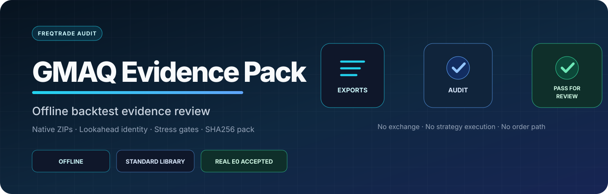

<p align="center">
  
</p>

<p align="center">
  <a href="https://github.com/jojo232386/gmaq-evidence-pack/actions/workflows/test.yml"></a>
  
  
  
  
</p>

<p align="center"><strong>Preflight native Freqtrade evidence before you review strategy code.</strong></p>

GMAQ Evidence Pack checks existing Freqtrade base/stress backtest ZIPs and lookahead CSVs before manual strategy review. It verifies artifact identity, applies frozen preflight checks, and produces a deterministic, fixed-whitelist public summary. The tool runs offline with the Python standard library. It does not grade strategies, choose pairlists, or replace code review.

Freqtrade warns that dynamic pairlists can break historical reproducibility and that backtests can diverge from dry/live behavior because of lookahead, recursive indicators, fills, and other assumptions. See the official [backtesting](https://docs.freqtrade.io/en/stable/backtesting/), [lookahead analysis](https://docs.freqtrade.io/en/stable/lookahead-analysis/), and [recursive analysis](https://docs.freqtrade.io/en/stable/recursive-analysis/) documentation.

## Scope

Run the preflight before you spend time reading strategy code. It filters incomplete, inconsistent, or unsafe evidence. A reviewer still has to understand the strategy, select an appropriate pairlist, explain failures, and judge robustness.

| The preflight checks | The reviewer decides |
| --- | --- |
| Artifact safety, run identity, static pairlist evidence, lookahead evidence, and frozen screening checks | Whether the pairlist fits the strategy and whether the strategy logic makes sense |
| Public/private output boundaries and recorded provenance gaps | Whether the result is robust, worth improving, or suitable for further observation |

## Quick start

Create the base, stress, and lookahead artifacts with native Freqtrade first. This tool reads those artifacts; it does not run the backtests.

```sh
git clone https://github.com/jojo232386/gmaq-evidence-pack.git
cd gmaq-evidence-pack

scripts/gmaq-evidence-pack \
  --base backtest-base.zip \
  --stress backtest-stress.zip \
  --base-fee 0.001 \
  --stress-fee 0.002 \
  --lookahead lookahead.csv \
  --output evidence-summary
```

The command reads supplied files only. It does not execute Freqtrade, import or execute strategy code, contact an exchange, use account credentials, or submit orders.

The default output contains only `public-summary.json`. It has no strategy name, pairlist, metrics, fee, hash, path, filename, check detail, or raw error. Follow the [public sharing profile](docs/PUBLIC_SHARING.md) before opening an issue.

## Verdicts

| Verdict | Meaning |
| --- | --- |
| `PASS_FOR_REVIEW` | Supplied evidence passed the frozen preflight checks; begin manual review |
| `REVIEW_REQUIRED` | The base export parsed, but stress or lookahead evidence is missing |
| `BLOCKED` | Artifact safety, identity, bias, reproducibility, or a frozen preflight check failed |

No verdict claims Alpha, profitability, live readiness, or safety to trade.

## Public output

```text
evidence-summary/
  public-summary.json
```

The summary is built from a fixed allowlist: format version, evidence-presence booleans, check names and statuses, the verdict, and four permanently false claim flags.

## Optional private archive

```sh
scripts/gmaq-evidence-pack \
  --base backtest-base.zip \
  --stress backtest-stress.zip \
  --base-fee 0.001 \
  --stress-fee 0.002 \
  --lookahead lookahead.csv \
  --output private-evidence-pack \
  --include-private-artifacts
```

```text
private-evidence-pack/
  inputs/
    base.zip
    stress.zip
    lookahead.csv
  public-summary.json
  manifest.json
  verdict.json
  report.md
  checksums.sha256
```

The private manifest binds input SHA256 values, strategy source, timeframe, timerange, pairlist, trading mode, portfolio limits, declared fees, base/stress metrics, and lookahead identity. Declared fee values carry `DECLARED_NOT_EMBEDDED_IN_FREQTRADE_EXPORT`, because a native ZIP does not prove the original CLI fee arguments.

The tool never applies a fee or adjusts profit after a backtest. Base and stress must come from two separate Freqtrade runs, and the stress export must already reflect the higher fee during its native run. Because the ZIP does not preserve the CLI `--fee` argument, `--base-fee` and `--stress-fee` remain unverified declarations; they cannot prove Freqtrade applied those values during either run. This provenance gap is tracked in [issue #2](https://github.com/jojo232386/gmaq-evidence-pack/issues/2).

**Never upload or share the private directory.** Its safety scan is defense in depth, not proof that every secret or proprietary detail was removed.

## Request a preflight review

Use the structured [Evidence preflight request](https://github.com/jojo232386/gmaq-evidence-pack/issues/new?template=audit-request.yml). It accepts `public-summary.json` and a bounded question. Never attach private-artifact output, raw ZIPs, strategy source, configs, databases, credentials, account data, hashes, or orders.

The first public-validation window and its stop conditions are recorded in [MARKET_VALIDATION.md](MARKET_VALIDATION.md). v0.2 will not be designed until external evidence shows a repeated problem.

## Frozen preflight checks

- bounded ZIP structure, path safety, CRC, duplicate names, normalized structured credential fields, and obvious literal-secret patterns;
- static pairlist plus exact base/stress strategy, source, timeframe, timerange, and portfolio identity;
- base return, profit factor, drawdown, trade count, and positive-profit concentration;
- stress return and profit factor with a declared fee at least twice the base fee;
- lookahead strategy identity, at least 20 checked signals, and zero biased entry/exit signals.

Malformed JSON/CSV, duplicate keys, negative signal counts, fractional trade counts, invalid drawdown values, identity drift, and dynamic pairlists fail closed.

## Technical acceptance on one internal sample

v0.1 audited real native E0 artifacts from `E0V1E_53_Sharpe`. This single internal sample validates the tool path; it does not validate Alpha, profitability, live readiness, or adoption.

| Evidence | Result |
| --- | --- |
| Base export | 227 trades, return `+66.47%`, PF `1.934`, account DD `16.60%` |
| 2× declared-fee stress | Return `+47.58%`, PF `1.701` |
| Lookahead | 20 checked signals, 0 biased entry/exit signals |
| Pack determinism | Two runs produced byte-identical public and private outputs |
| Verdict | `PASS_FOR_REVIEW` |

The committed [acceptance record](results/e0-v0.1-acceptance.json) binds the private local inputs and technical outputs while keeping the source ZIPs, exported config, and strategy file outside Git. The result remains a screening decision for human review.

## Verify

```sh
python3 -m unittest discover -s tests -v
python3 -m py_compile gmaq_evidence_pack.py scripts/gmaq-evidence-pack
```

The frozen product boundary and acceptance rules live in [PRODUCT_CONTRACT.md](PRODUCT_CONTRACT.md). The software is available under the [MIT License](LICENSE).
